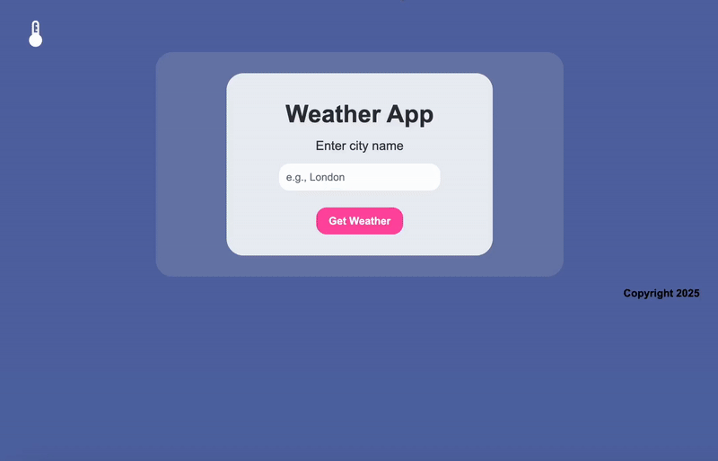

# 🌤️ Laravel Weather App
## 📘 Task Overview
A simple weather app built with Laravel that fetches current weather data from an external weather API. With the app you simply input a city name and press button to get real time weather information.

___

### ✅ Features
* Search weather by city name
* Fetches real time weather data from an external API
* Displays temperature, weather description, humidity and wind speed
* API key is hidden

___

### 🛠️ Tech Stack
* Laravel
* PHP
* Herd
* CSS 
* External Weather API 
## 🌦️ Weather App Demo

### 🔁 Preview

  

### 🎥 YouTube Demo

Watch it here: [https://www.youtube.com/watch?v=Qh-3T4S9AFc](https://www.youtube.com/watch?v=Qh-3T4S9AFc)
