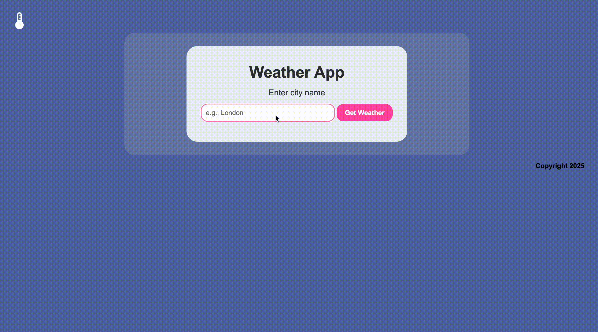

# 🌤️ Laravel Weather App
## 📘 Task Overview
A simple weather app built with Laravel that fetches current weather data from an external weather API. With the app you simply input a city name and press button to get real time weather information.

___

### ✅ Features
* Search weather by city name
* Fetches real time weather data from an external API
* Displays temperature, weather description, humidity and wind speed
* API key is hidden

___

### 🛠️ Tech Stack
* Laravel
* PHP
* Herd
* CSS 
* External Weather API 

---

## 🚀 Preview

 #### 🎬 [Watch Full Demo on YouTube!](https://youtu.be/mGgRkXncgJc)
